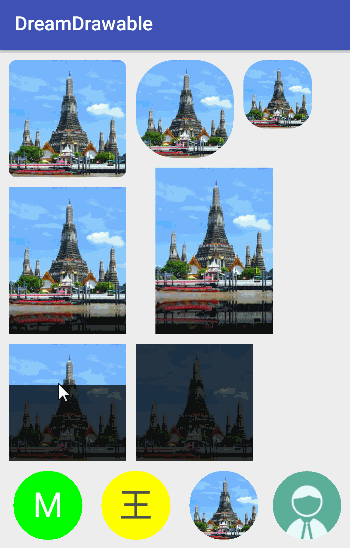

# DreamDrawable

一个项目玩转 Android 自定义 Drawable，具体原理参见[《Android 应用层开发 Drawable 的一些叨叨絮》](http://blog.csdn.net/yanbober/article/details/56844869)，效果如下图所示。

# 说明文档

当前实现了多个 Customer Drawable，依据自己情况使用其一即可，互相无任何依赖。

| 类型 | 定义 | 说明 |
| ----- | ----- | ----- |
| **RoundDrawable** | RoundDrawable | 圆角 Drawable，可实现类似上图中第一行各种效果。 |
|方法| RoundDrawable(Bitmap bitmap) | 构造方法直接传递一个 Bitmap 即可，然后使用即可，譬如ImageView.setImageDrawable(drawable); |
| **ReflectionDrawable** | ReflectionDrawable | 底部具备倒影效果的 Drawable，可以实现类似上图中第二行各种效果等。 |
|方法| ReflectionDrawable(Bitmap bitmap) | 构造方法直接传递一个 Bitmap 即可，然后使用即可，譬如ImageView.setImageDrawable(drawable); |
|方法| setReflectionHeight(@IntRange(from = 0) int height) | 给 ReflectionDrawable 设置底部反转倒影的高度。 |
| **LauncherIconDrawable** | LauncherIconDrawable | 具备进度刷新效果的 Drawable，譬如 miui 桌面 app 更新图标进度，类似上图第三行等效果，还可配置。譬如ImageView.setImageDrawable(drawable); |
|方法|LauncherIconDrawable(Drawable drawable)|构造方法传递一个 Drawable，譬如传递 ImageView.getDrawable(); |
|方法|setDefaultColor(@ColorInt int defaultColor)|设置 LauncherIconDrawable 中图片默认的覆盖颜色，模式为 PorterDuff.Mode.MULTIPLY。|
|方法|setDefaultColor(@ColorInt int defaultColor, PorterDuff.Mode mode)|同上，设置 LauncherIconDrawable 中图片默认的覆盖颜色。|
|方法|setPercentColor(@ColorInt int percentColor)|设置 LauncherIconDrawable 中进度的覆盖颜色，模式为 PorterDuff.Mode.MULTIPLY。|
|方法|setPercentColor(@ColorInt int percentColor, PorterDuff.Mode mode)|同上，设置 LauncherIconDrawable 中进度的覆盖颜色。|
|方法|setCurPercent(@FloatRange(from = 0f, to = 1f) float curPercent)|设置当前进度为多少，类似 miui App 更新桌面图标进度更新。|
|**IconView**|IconView|类似 Flyme 6.0 联系人 Icon 的 Drawable 的 View，可以实现类似上图中最后一行的各种效果，配合下面的 IconDrawable 使用。|
|方法|IconDrawable getIconDrawable()|获取 IconView 中的 IconDrawable 来使用。|
|**IconDrawable**|IconDrawable|配合上面 IconView 内部使用的，不用自己 new，只用通过 IconView 的 IconDrawable getIconDrawable() 获取来操作。|
|方法|setTextLabel(String str)|设置文字，譬如联系人姓或者首字母等。|
|方法|setTextFontSize(int size)|设置文字大小，不设置默认会自适应。|
|方法|setTextColor(int color)|设置文字颜色。|
|方法|setBackgroundColor(int color)|设置为文字时的背景颜色。|
|方法|setIconLabel(Bitmap bitmap)|设置为联系人默认或者真是头像。|

# License 声明

MIT License

Copyright (c) 2017 yanbo

Permission is hereby granted, free of charge, to any person obtaining a copy
of this software and associated documentation files (the "Software"), to deal
in the Software without restriction, including without limitation the rights
to use, copy, modify, merge, publish, distribute, sublicense, and/or sell
copies of the Software, and to permit persons to whom the Software is
furnished to do so, subject to the following conditions:

The above copyright notice and this permission notice shall be included in all
copies or substantial portions of the Software.

THE SOFTWARE IS PROVIDED "AS IS", WITHOUT WARRANTY OF ANY KIND, EXPRESS OR
IMPLIED, INCLUDING BUT NOT LIMITED TO THE WARRANTIES OF MERCHANTABILITY,
FITNESS FOR A PARTICULAR PURPOSE AND NONINFRINGEMENT. IN NO EVENT SHALL THE
AUTHORS OR COPYRIGHT HOLDERS BE LIABLE FOR ANY CLAIM, DAMAGES OR OTHER
LIABILITY, WHETHER IN AN ACTION OF CONTRACT, TORT OR OTHERWISE, ARISING FROM,
OUT OF OR IN CONNECTION WITH THE SOFTWARE OR THE USE OR OTHER DEALINGS IN THE
SOFTWARE.